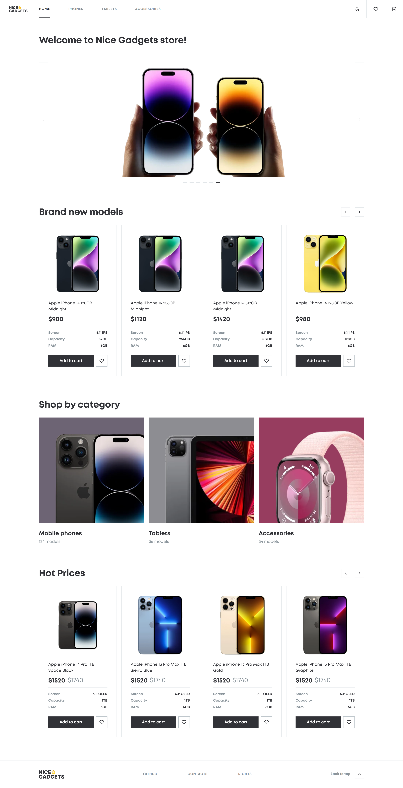
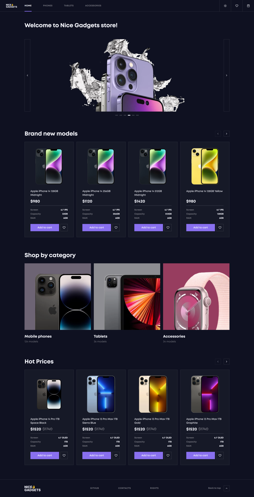
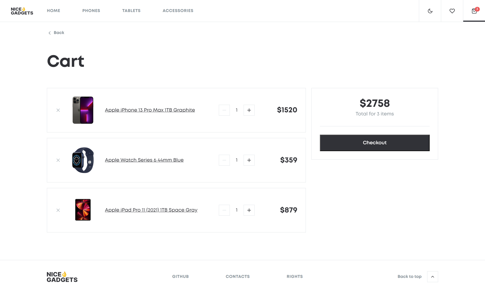

# 📱 Nice Gadgets — Phone Catalog

An **e-commerce SPA** built with **React** and **TypeScript**, focused on performance, scalability, and clean architecture. The application simulates a real-world online store with product browsing, filtering, cart management, and persistent UI state.

---

## 🔗 Live Demo

[👉 PROJECT DEMO](https://nazarii-lesniak.github.io/advanced-react-phone-catalog/)

---

## 🎨 UI/UX & Design Implementation

- **Figma pixel-perfect matching:** Developed strictly according to the professional design layout to maintain clean visual standards.
- **Figma Design:**
  - [👉 View Original Design Concept Light](https://www.figma.com/design/T5ttF21UnT6RRmCQQaZc6L/Phone-catalog--V2--Original?node-id=0-1&p=f&t=nSjwk22YOV9WY0o5-0)
  - [👉 View Original Design Concept Dark](https://www.figma.com/design/BUusqCIMAWALqfBahnyIiH/Phone-catalog--V2--Original-Dark?node-id=0-1&p=f&t=JePbDiuYs9D1XZMO-0) <br> The UI was built strictly according to professional design specifications to ensure high-end visual standards.
- **Responsive design:** Fully adaptive layout across mobile, tablet, and desktop devices using modular SCSS and custom media queries.

---


## 🎯 Purpose

This project was built to practice and demonstrate:

- Advanced **React architecture**
- Building and scaling **custom hooks**
- State management using **Context API**
- Performance optimization (**debounce, lazy loading**)
- Writing clean, maintainable, and reusable code

---

## 📸 Screenshots

<details>
<summary><b>Click to expand screenshots (Light / Dark mode)</b></summary>
<br>

### Home Page (Light Mode)


### Home Page (Dark Mode)


### Shopping Cart (Light Mode)


</details>

---

## ✨ Key Features

 - **📦 Product Catalog**
Browse phones, tablets, and accessories with sorting, filtering, and URL-based pagination.

 - **🔍 Search with Debounce**
Optimized search using a custom `useDebounce` hook to reduce unnecessary re-renders.

 - **🛒 Shopping Cart**
Add/remove items, change quantity, and calculate total price. State is managed via Context API.

 - **❤️ Favorites (Wishlist)**
Save products using a dedicated context provider.

 - **🌙 Theme Toggle**
Persistent Light/Dark mode using `ThemeContext`.

 - **🖼️ Product Details Page**
Includes gallery, selectable options (color/capacity), and related products slider.

 - **🎠 Custom Products Slider**
Built from scratch using `useSlider` and `useSwipe` hooks.

 - **⚡ Code Splitting**
Lazy loading with `React.lazy` and `Suspense` for better performance.

 - **🛡️ Error Boundary**
Application-level error handling.

 - **♿ Accessibility**
Semantic HTML and basic a11y support using `eslint-plugin-jsx-a11y`.

---

## 🧠 Challenges & Solutions

| Challenge | Solution |
|---|---|
| URL-based state management | Implemented via custom hook `useCatalogParams` |
| Performance optimization | Debounce + lazy loading + optimized renders |
| Reusable UI logic | Extracted into custom hooks (`useSlider`, `useSwipe`) |
| Scalable structure | Organized into modular structure (modules, components, hooks, contexts) |

---

## 🏗 Architecture Overview

**Global state handled via React Context:**
- `CartContext`
- `FavoritesContext`
- `ThemeContext`

**Separation of concerns:**
- `/api` — data fetching layer
- `/components` — reusable UI
- `/modules` — page-level logic (lazy-loaded)
- `/hooks` — reusable logic
- `/utils` — helper functions

---

## 🗂 Project Structure

```text
src/
├── api/          # Data fetching layer
├── assets/       # Static assets (images, logo)
├── components/   # Reusable UI components
├── constants/    # Application constants
├── context/      # Global state providers (Cart, Favorites, Theme)
├── hooks/        # Custom reusable React hooks
├── modules/      # Page-level logic & complex layouts
├── styles/       # Global styles
├── types/        # Shared TypeScript interfaces
└── utils/        # Helper functions
```
---

## 🛠 Technologies Used

| Category | Tool / Library |
|---|---|
| UI | React 18 |
| Language | TypeScript 5 |
| Build Tool | Vite 5 |
| Routing | React Router DOM v6 (HashRouter) |
| Styling | Modular SCSS (BEM, mixins, variables) |
| State Management | React Context API |
| Linting | ESLint + Prettier + Stylelint |
| Deployment | GitHub Pages |

---

## 🚀 Getting Started

### Prerequisites

- Node.js v20+
- npm v10+

### 1. Installation

```bash
git clone https://github.com/Nazarii-Lesniak/advanced-react-phone-catalog.git
cd advanced-react-phone-catalog
```
### 2. Install dependencies

```bash
npm install
```

### 3. Available Scripts

```bash
# Start development server
npm start

# Build for production
npm run build

# Deploy to GitHub Pages
npm run deploy

# Run linters
npm run lint

# Format code
npm run format

# Format styles
npm run style-format
```

---

## 📄 License

This project is licensed under the [GPL-3.0 License](./LICENSE).
